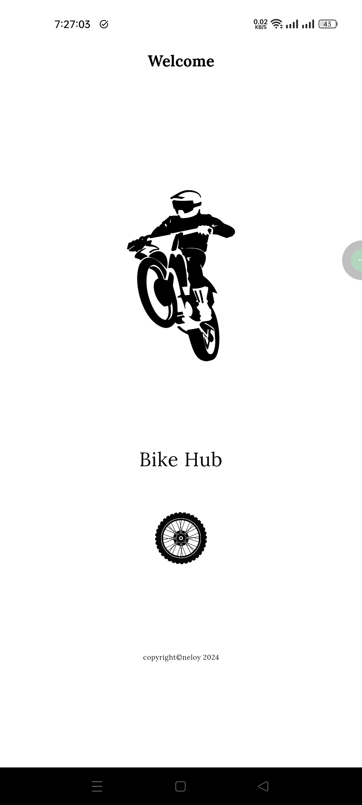

# Bike Hub

A simple flutter application for an admin user that will be used for show, add, update & delete
operations for bikes.

## Tools and Technologies:

1. Framework: flutter-3.22.2
2. Programming language: dart-3.4.3
3. IDE: android studio-koala | 2024.1.1

## Packages:

1. http: ^0.13.6

## Features:

1. bike list
2. bike details
3. request for add new bike

**backend project repository link:** https://github.com/Neloy-SWE/Your-Bike-User-Backend

to run the flutter app, you need to setup the backend first. you may find details about the backend
project in it's **readme.md** file.

## Screenshots:

  
  
  
  
  
  
  